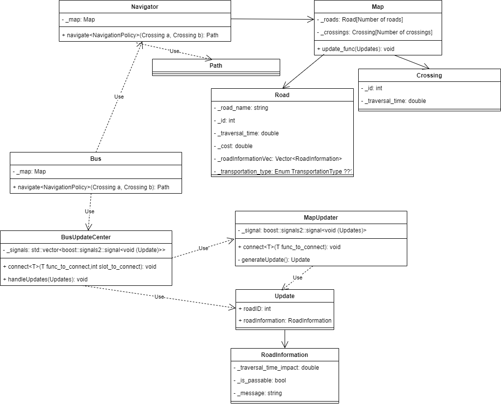

# NavSys Docs

## Diagrams
The documentation branch contains a drawio file with a class and sequence diagram as well as a domain model.
These are furthermore presented here in image format, in case the noob Thomasgl710 does not have diagrams.net

These diagrams are only a draft of the system design, and may be changed along the way.

### Domain model

### Class diagram

### Sequence diagram
